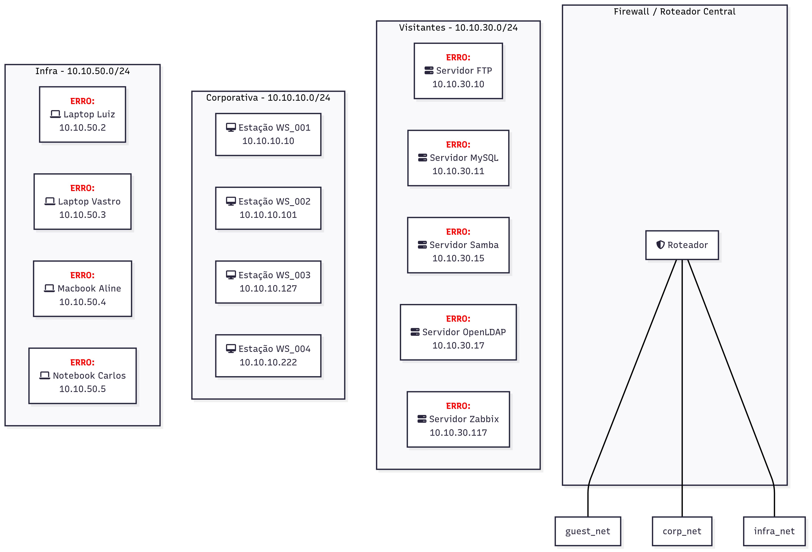
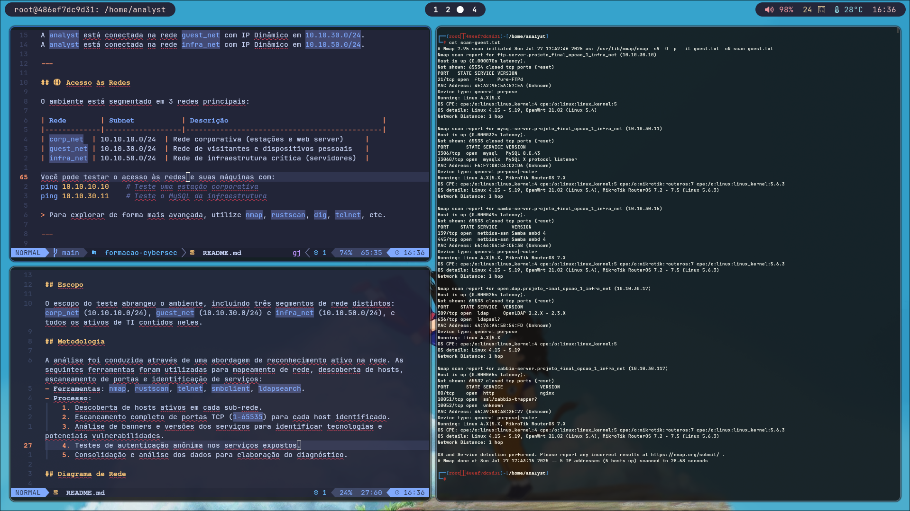
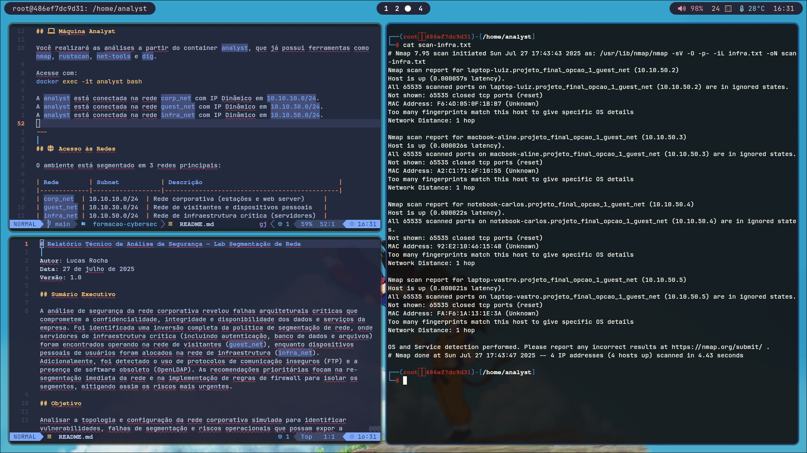
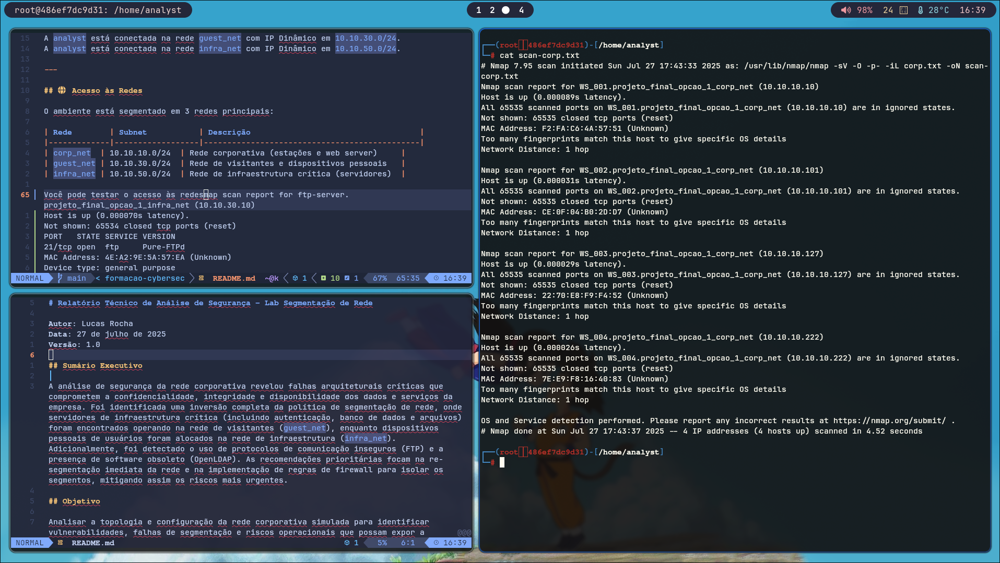
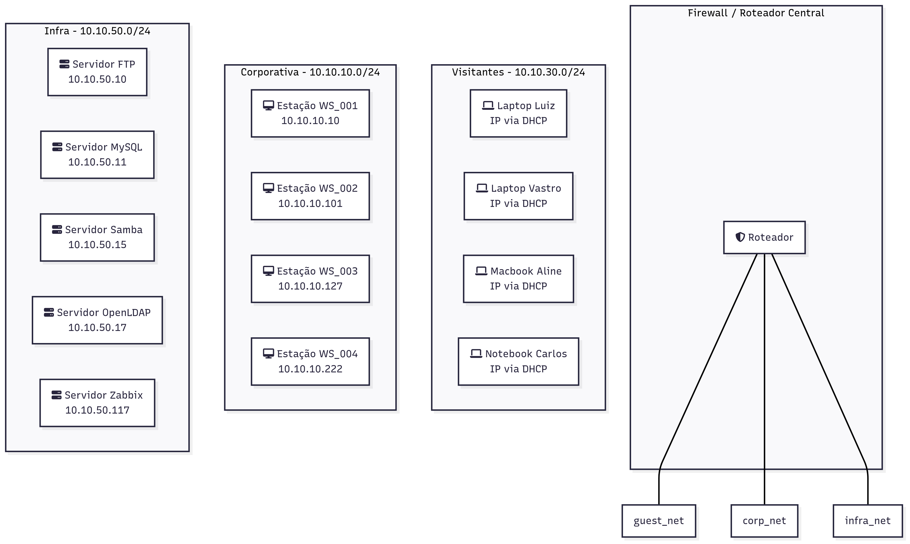

# Relatório Técnico de Análise de Segurança – Lab Segmentação de Rede

**Autor:** Lucas Rocha
**Data:** 27 de julho de 2025
**Versão:** 1.1

## Sumário Executivo

A análise de segurança da rede corporativa revelou falhas arquiteturais críticas que comprometem a confidencialidade, integridade e disponibilidade dos dados e serviços da empresa. Foi identificada uma inversão completa da política de segmentação de rede, onde servidores de infraestrutura crítica foram encontrados operando na rede de visitantes (`guest_net`), enquanto dispositivos pessoais de usuários foram alocados na rede de infraestrutura (`infra_net`). Adicionalmente, foi detectado o uso de protocolos inseguros (FTP), a presença de software obsoleto (OpenLDAP) e configurações de serviço permissivas. As recomendações prioritárias focam na re-segmentação imediata da rede e na implementação de regras de firewall para mitigar os riscos mais urgentes.

## Objetivo

Analisar a topologia e configuração da rede corporativa simulada para identificar vulnerabilidades, falhas de segmentação e riscos operacionais que possam expor a organização a ameaças cibernéticas.

## Escopo

O escopo do teste abrangeu o ambiente simulado, incluindo três segmentos de rede distintos: `corp_net` (10.10.10.0/24), `guest_net` (10.10.30.0/24) e `infra_net` (10.10.50.0/24), e todos os ativos de TI contidos neles.

## Metodologia

A análise foi conduzida através de uma abordagem de reconhecimento ativo na rede. As seguintes ferramentas foram utilizadas para mapeamento de rede, descoberta de hosts, escaneamento de portas e identificação de serviços:
- **Ferramentas:** `nmap`, `rustscan`, `telnet`, `smbclient`, `ldapsearch`.
- **Processo:**
    1. Descoberta de hosts ativos em cada sub-rede.
    2. Escaneamento completo de portas TCP (`1-65535`) para cada host identificado.
    3. Análise de banners e versões dos serviços para identificar tecnologias e potenciais vulnerabilidades.
    4. Testes de autenticação anônima nos serviços expostos.
    5. Consolidação e análise dos dados para elaboração do diagnóstico.

## Diagrama de Rede

Os diagramas abaixo ilustram a arquitetura de rede encontrada e a arquitetura recomendada para correção das falhas de segurança.


*Figura 1: Arquitetura atual da rede, demonstrando as falhas críticas de segmentação.*

## Diagnóstico (Achados)

**Achado 1: Falha Crítica de Segmentação – Servidores de Infraestrutura na Rede de Visitantes**
- **Hosts:** `ftp-server`, `mysql-server`, `samba-server`, `openldap`, `zabbix-server`
- **IPs:** Segmento `10.10.30.0/24` (`guest_net`)
- **Risco Identificado (CRÍTICO):** Toda a infraestrutura de TI crítica, incluindo o servidor de autenticação (OpenLDAP), banco de dados MySQL e servidor de arquivos Samba, está localizada na rede menos confiável da empresa. Isso elimina a proteção que a segmentação deveria oferecer.
- **Evidência:** Os scans do `nmap` da `guest_net` mostram os hosts com nomes `*_infra_net` possuindo IPs na faixa `10.10.30.0/24`.



**Achado 2: Falha Crítica de Segmentação – Dispositivos Pessoais na Rede de Infraestrutura**
- **Hosts:** `laptop-luiz`, `macbook-aline`, `notebook-carlos`, `laptop-vastro`
- **IPs:** Segmento `10.10.50.0/24` (`infra_net`)
- **Risco Identificado (CRÍTICO):** Dispositivos de usuários finais, vetores comuns de infecção, estão na rede que deveria ser a mais protegida, permitindo acesso direto a ativos críticos se comprometidos.
- **Evidência:** O scan da rede `infra_net` confirma a presença de dispositivos pessoais incorretamente alocados.



**Achado 3: Risco Alto – Uso de Protocolo Inseguro (FTP)**
- **Host/IP:** `ftp-server` (10.10.30.10)
- **Porta:** 21/tcp
- **Risco Identificado (ALTO):** O serviço de FTP transmite credenciais em texto puro, permitindo a captura por um atacante na rede.
- **Evidência:**
```
Nmap scan report for ftp-server.projeto_final_opcao_1_infra_net (10.10.30.10)
PORT   STATE SERVICE VERSION
21/tcp open  ftp     Pure-FTPd
```

**Achado 4: Risco Alto – Software de Autenticação Obsoleto**
- **Host/IP:** `openldap` (10.10.30.17)
- **Porta:** 389/tcp
- **Risco Identificado (ALTO):** O servidor OpenLDAP (`2.2.X - 2.3.X`) está severamente desatualizado, expondo o serviço de autenticação central a múltiplas vulnerabilidades conhecidas.
- **Evidência:**
```
Nmap scan report for openldap.projeto_final_opcao_1_infra_net (10.10.30.17)
PORT    STATE SERVICE  VERSION
389/tcp open  ldap     OpenLDAP 2.2.X - 2.3.X
```

**Achado 5: Risco Médio – Permissão de Conexão Anônima no LDAP**
- **Host/IP:** `openldap` (10.10.30.17)
- **Observação:** O servidor LDAP, embora bloqueie a listagem do diretório, permite conexões anônimas (anonymous bind). Esta permissão pode ser abusada para validar a existência de nomes de usuário ou para realizar ataques de força bruta e *password spraying*.
- **Evidência:** O teste com `ldapsearch` confirmou que a conexão inicial é aceita, mas a busca pelo conteúdo falha, enquanto a busca pelo `namingContexts` tem sucesso, validando a política.
```
# Teste de busca no diretório (falhou)
ldapsearch -x -H ldap://10.10.30.17 -b "dc=example,dc=org"
result: 32 No such object

# Teste de busca pelo namingContext (sucesso)
ldapsearch -x -H ldap://10.10.30.17 -s base "(objectclass=*)" namingContexts
namingContexts: dc=example,dc=org
result: 0 Success
```

**Achado 6: Boa Prática – Segurança na Rede Corporativa**
- **Hosts:** `WS_001`, `WS_002`, `WS_003`, `WS_004`
- **IPs:** Segmento `10.10.10.0/24` (`corp_net`)
- **Observação (POSITIVA):** As estações de trabalho da rede corporativa não expõem nenhuma porta TCP, indicando uma política eficaz de firewall de host.
- **Evidência:** O scan da rede `corp_net` mostrou todos os 65535 ports em estado "closed/ignored".



## Recomendações

1.  **Re-segmentação Imediata da Rede:** Realocar todos os servidores para a sub-rede de infraestrutura (`infra_net`) e os dispositivos de usuários finais para a `guest_net`, que deve operar com DHCP.
2.  **Implementação de Regras de Firewall (ACLs):** Configurar Access Control Lists para impor o isolamento total da `guest_net` em relação às redes internas (`corp_net`, `infra_net`).
3.  **Descomissionar o Protocolo FTP:** Substituir o serviço de FTP por uma alternativa segura como SFTP (SSH File Transfer Protocol).
4.  **Atualização de Software Crítico:** O servidor OpenLDAP deve ser atualizado para a versão estável mais recente.
5.  **Revisão de Configuração dos Serviços (Hardening):** Após a realocação, revisar as configurações dos serviços para seguir o princípio do menor privilégio. Para o OpenLDAP, isso inclui desabilitar o *anonymous bind*. Para MySQL e outros, garantir senhas fortes.


*Figura 2: Arquitetura recomendada, com os ativos alocados em seus respectivos segmentos de segurança.*

## Plano de Ação (80/20)

| Ação                                           | Impacto no Risco | Facilidade | Prioridade |
|------------------------------------------------|------------------|------------|------------|
| Mover servidores para `infra_net` e laptops para `guest_net` | **Crítico** | Média      | **1 - Máxima** |
| Implementar regras de firewall para isolar redes | **Crítico** | Média      | **2 - Máxima** |
| Desativar o serviço de FTP (porta 21)          | Alto             | Alta       | **3 - Alta** |
| Fortalecer configuração do LDAP (desativar bind anônimo) | Médio            | Média      | 4 - Média      |
| Atualizar o servidor OpenLDAP                  | Alto             | Baixa      | 5 - Média      |

## Conclusão

A análise de segurança revelou uma arquitetura de rede fundamentalmente insegura, com falhas de segmentação que expõem os ativos mais críticos da organização a riscos imediatos. Embora existam pontos positivos, como o hardening das estações de trabalho, eles são ofuscados pela exposição sistêmica dos servidores. A implementação do plano de ação, começando pela re-segmentação da rede, é mandatória para estabelecer um nível mínimo de segurança e proteger a empresa contra comprometimentos.

## Ferramentas auxiliares:
- Gemini: Utilizado para auxiliar na criação do relatório.
- Mermaid Chart: Utilizado na criação dos diagramas de arquitetura de rede (Estado Atual e Recomendado).

## Outros Anexos
- [Saídas completas dos scans do Nmap (`scan-corp.txt`, `scan-guest.txt`, `scan-infra.txt`)](files/scans.md);
- [Logs sbmclient](files/smbclient-log.txt);
- [Logs ldap](files/ldap-log.txt);
- [Ips encontrados](files/ips.md).